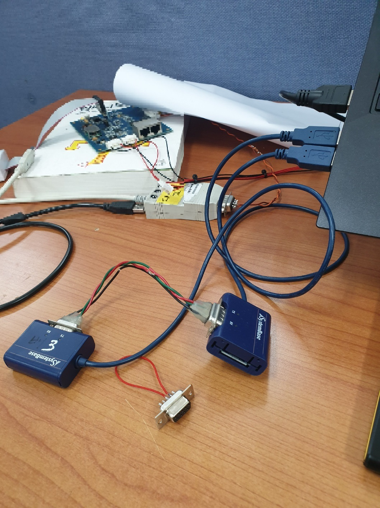
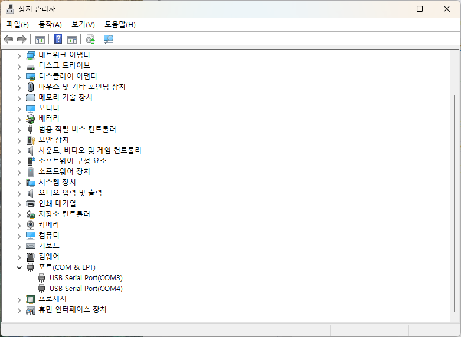
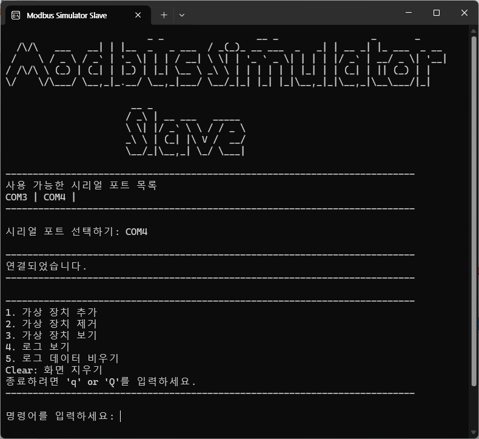
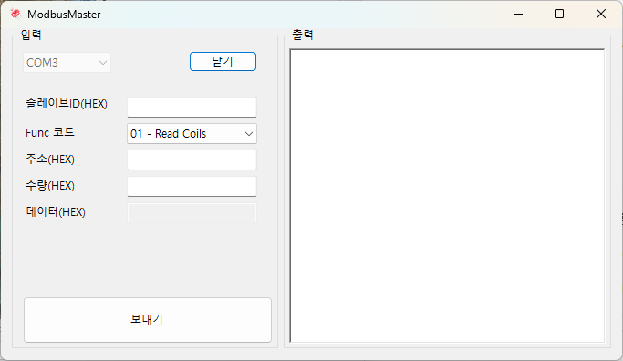
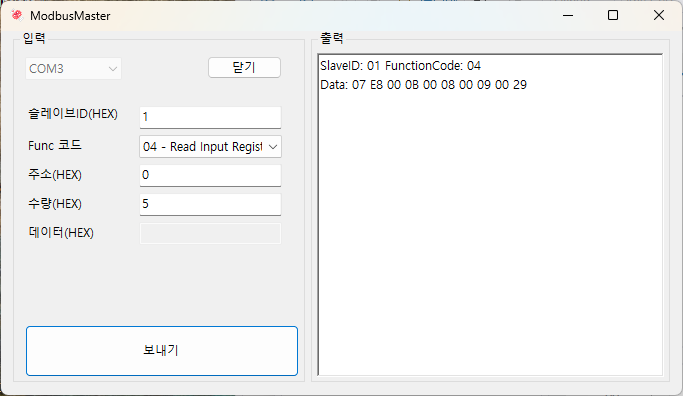

# Modbus Simulator 사용 방법

이 문서는 Modbus Simulator 프로젝트의 사용 방법을 설명합니다. 프로젝트는 **ModBusSim Master**와 **ModBusSim Slave** 애플리케이션으로 구성되어 있으며, C#을 사용해 각각 구현되어 ModBus 요청 및 응답의 순환 과정을 관찰할 수 있습니다.

## 목차

- [0. 준비 사항](#0-준비-사항)
- [1. Master & Slave 애플리케이션 실행](#1-master--slave-애플리케이션-실행)
- [2. Modbus 통신](#2-modbus-통신)
- [3. Slave 가상 장치 설정](#3-slave-가상-장치-설정)
- [4. Function Code](#4-function-code)

## 0. 준비 사항

- **하드웨어**: 두 개의 RS-232 포트를 컴퓨터에 연결하고 각 포트에 서로 다른 COM 포트를 할당합니다.

RS-232 포트를 크로스 케이블로 서로 연결하고 각 포트에 COM 포트를 할당합니다.

RS-232 포트에 할당된 COM 포트를 확인합니다.

- **소프트웨어**: 이 애플리케이션은 .NET 8이상이 필요합니다.

## 1. Master & Slave 애플리케이션 실행

 - **Slave 애플리케이션**(콘솔 앱)을 실행하고 특정 COM 포트에서 수신하도록 설정합니다.

 

 - **Master 애플리케이션**(WinForms 앱)을 실행하고 Slave와의 통신을 위한 서로 다른 COM 포트를 선택합니다.
	- EX) Master Port : COM3, Slave Port : COM4

 

## 2. Modbus 통신

0. 슬레이브에서 포트 연결 시 주소가 1인 가상장치가 미리 생성되어 있습니다.(주소: 1, 코일 개수: 10, 레지스터: 10)
1. 마스터에서 원하는 슬레이브 주소와 기능 코드를 선택합니다.
2. 마스터에서 요청할 데이터의 시작 주소와 데이터 개수(혹은 데이터 혹은 데이터 개수와 데이터 둘다)를 입력합니다.
3. 마스터에서 보내기 버튼을 클릭하면 슬레이브로 요청 패킷이 전송됩니다.
4. 슬레이브는 요청 패킷을 받아 처리하고 응답 패킷을 마스터로 전송합니다.
5. 마스터는 응답 패킷을 받아 화면에 출력합니다.

## 3. Slave 가상 장치 설정

- 슬레이브 어플리케이션에서는 콘솔를 이용하여 가상 장치를 설정할 수 있습니다.
- 콘솔에서 다음과 같은 기능을 사용할 수 있습니다.
	1. 가상 장치 추가
	2. 가상 장치 제거
	3. 가상 장치 보기
	4. 로그 보기
	5. 로그 데이터 비우기
	- 그외 `Clear` 명령어를 입력하면 콘솔 화면이 초기화되고 `Q` 나 `q`를 입력하면 어플리케이션이 종료됩니다.

 - 가상 장치 추가
	- 가상 장치 추가를 선택하면 가상 장치의 주소, 코일 개수, 레지스터 개수를 입력받습니다.
		- EX) 2, 10, 10 - 입력한 정보로 가상 장치가 생성됩니다.
		- 코일 개수와 레지스터 개수의 최소 개수는 10개입니다.
	- 입력한 정보로 가상 장치가 생성됩니다.
		- 가상장치는 입력 레지스터 0번 부터 5번까지 가상장치가 생성된 년도부터 초까지 순차적으로 저장되어 생성됩니다.
		- 입력 상태 코일은 코일 개수 만큼 ON/OFF가 랜덤으로 설정됩니다.
	- 각 가상장치는 입력 레지스터
	- etc) 주소가 1인 가상 장치는 미리 생성되어 있습니다.

- 가상 장치 제거
	- 가상 장치 제거를 선택하면 가상 장치의 주소를 입력받습니다.
		- EX) 2 - 입력한 주소의 가상 장치가 제거됩니다.

- 가상 장치 보기
	- 가상 장치 보기를 선택하면 현재 생성된 가상 장치의 정보를 출력합니다.

- 로그 보기
	- 로그 보기를 선택하면 현재까지의 로그를 출력합니다.
	- 로그는 요청 패킷과 응답 패킷이 출력됩니다.

- 로그 데이터 비우기
	- 로그 삭제를 선택하면 현재까지의 모든 로그를 삭제합니다.

## 4. Function Code

- Master는 다음 명령을 전송할 수 있습니다:
	- Coil 상태 읽기 (기능 코드: 0x01)
	- Discrete Inputs 상태 읽기 (기능 코드: 0x02)
	- Holding 레지스터 읽기 (기능 코드: 0x03)
	- Input 레지스터 읽기 (기능 코드: 0x04)
	- Coil 상태 쓰기 (기능 코드: 0x05)
	- Holding 레지스터 쓰기 (기능 코드: 0x06)
	- 멀티 Coil 쓰기 (기능 코드: 0x15)
	- 멀티 레지스터 쓰기 (기능 코드: 0x16)

#### Coil 상태 읽기 (기능 코드: 0x01)
- 시작 주소와 읽을 개수를 입력하면 해당하는 코일의 상태를 읽어옵니다.
- Requsets Packet은 다른과 같은 데이터가 들어가 있습니다:
	- Slave Address : 1byte
	- Function Code : 1byte
	- Starting Address : 2byte
	- Quantity of Coils : 2byte
	- CRC : 2byte

- Response Packet은 다음과 같은 데이터가 들어가 있습니다:
	- Slave Address : 1byte
	- Function Code : 1byte
	- Byte Count : 1byte
	- Coil Status : nbyte (n = Quantity of Coils / 8 + Quantity of Coils % 8)
	- CRC : 2byte

#### Discrete Inputs 상태 읽기 (기능 코드: 0x02)
- 시작 주소와 읽을 개수를 입력하면 해당하는 디지털 입력의 상태를 읽어옵니다.
- Requsets Packet은 다음과 같은 데이터가 들어가 있습니다:
	- Slave Address : 1byte
	- Function Code : 1byte
	- Starting Address : 2byte
	- Quantity of Inputs : 2byte
	- CRC : 2byte

- Response Packet은 다음과 같은 데이터가 들어가 있습니다:
	- Slave Address : 1byte
	- Function Code : 1byte
	- Byte Count : 1byte
	- Input Status : nbyte (n = Quantity of Inputs / 8 + Quantity of Inputs % 8)
	- CRC : 2byte

#### Holding 레지스터 읽기 (기능 코드: 0x03)
- 시작 주소와 읽을 개수를 입력하면 해당하는 레지스터의 값을 읽어옵니다.
- Requsets Packet은 다음과 같은 데이터가 들어가 있습니다:
	- Slave Address : 1byte
	- Function Code : 1byte
	- Starting Address : 2byte
	- Quantity of Registers : 2byte
	- CRC : 2byte

- Response Packet은 다음과 같은 데이터가 들어가 있습니다:
	- Slave Address : 1byte
	- Function Code : 1byte
	- Byte Count : 1byte
	- Register Value : nbyte (n = Quantity of Registers * 2)
	- CRC : 2byte

#### Input 레지스터 읽기 (기능 코드: 0x04)
- 시작 주소와 읽을 개수를 입력하면 해당하는 입력 레지스터의 값을 읽어옵니다.
- Requsets Packet은 다음과 같은 데이터가 들어가 있습니다:
	- Slave Address : 1byte
	- Function Code : 1byte
	- Starting Address : 2byte
	- Quantity of Registers : 2byte
	- CRC : 2byte

- Response Packet은 다음과 같은 데이터가 들어가 있습니다:
	- Slave Address : 1byte
	- Function Code : 1byte
	- Byte Count : 1byte
	- Register Value : nbyte (n = Quantity of Registers * 2)
	- CRC : 2byte

#### Coil 상태 쓰기 (기능 코드: 0x05)
- 시작 주소와 쓸 데이터를 입력하면 해당하는 코일의 상태를 설정합니다.
- Requsets Packet은 다음과 같은 데이터가 들어가 있습니다:
	- Slave Address : 1byte
	- Function Code : 1byte
	- Starting Address : 2byte
	- Output Value : 2byte (0x0000 or 0xFF00)
	- CRC : 2byte

- Response Packet은 다음과 같은 데이터가 들어가 있습니다:
	- Slave Address : 1byte
	- Function Code : 1byte
	- Starting Address : 2byte
	- Output Value : 2byte (0x0000 or 0xFF00)
	- CRC : 2byte

#### Holding 레지스터 쓰기 (기능 코드: 0x06)
- 시작 주소와 쓸 데이터를 입력하면 해당하는 레지스터의 값을 씁니다.
- Requsets Packet은 다음과 같은 데이터가 들어가 있습니다:
	- Slave Address : 1byte
	- Function Code : 1byte
	- Starting Address : 2byte
	- Output Value : 2byte
	- CRC : 2byte

- Response Packet은 다음과 같은 데이터가 들어가 있습니다:
	- Slave Address : 1byte
	- Function Code : 1byte
	- Starting Address : 2byte
	- Output Value : 2byte
	- CRC : 2byte

#### 멀티 Coil 쓰기 (기능 코드: 0x15)
- 시작 주소와 쓸 개수, 쓸 데이터를 입력하면 해당하는 코일들의 상태를 설정합니다.
- Requsets Packet은 다음과 같은 데이터가 들어가 있습니다:
	- Slave Address : 1byte
	- Function Code : 1byte
	- Starting Address : 2byte
	- Quantity of Outputs : 2byte
	- Byte Count : 1byte
	- Output Value : nbyte (n = Quantity of Outputs / 8 + Quantity of Outputs % 8)
		- 각 비트는 시작 주소부터 순서대로 코일 상태를 나타냅니다.
		- EX) 시작 주소가 0일 때 0x0003 - 0번째 코일은 ON, 1번째 코일은 OFF
	- CRC : 2byte

- Response Packet은 다음과 같은 데이터가 들어가 있습니다:
	- Slave Address : 1byte
	- Function Code : 1byte
	- Starting Address : 2byte
	- Quantity of Outputs : 2byte
	- CRC : 2byte

#### 멀티 레지스터 쓰기 (기능 코드: 0x16)
- 시작 주소와 쓸 개수, 쓸 데이터를 입력하면 해당하는 레지스터들의 값을 씁니다.
- Requsets Packet은 다음과 같은 데이터가 들어가 있습니다:
	- Slave Address : 1byte
	- Function Code : 1byte
	- Starting Address : 2byte
	- Quantity of Outputs : 2byte
	- Byte Count : 1byte
	- Output Value : nbyte (n = Quantity of Outputs * 2)
	- CRC : 2byte

- Response Packet은 다음과 같은 데이터가 들어가 있습니다:
	- Slave Address : 1byte
	- Function Code : 1byte
	- Starting Address : 2byte
	- Quantity of Outputs : 2byte
	- CRC : 2byte
