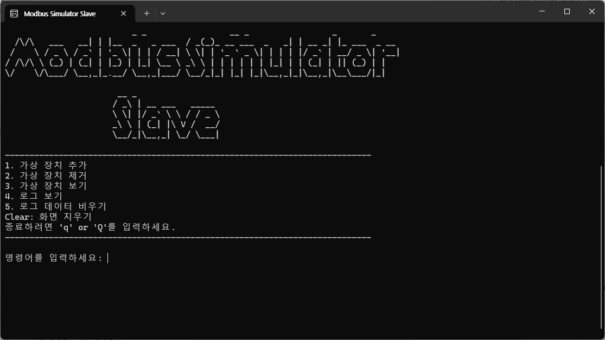

# ModBus Simulator


ModBus 통신을 체험해 볼 수 있는 간단한 시뮬레이터입니다. ModBus 프로토콜을 학습하기 위한 목적에서 개발된 이 프로젝트는 **ModBusSim Master**와 **ModBusSim Slave** 애플리케이션으로 구성되어 있으며, C#을 사용해 각각 구현되어 ModBus 요청 및 응답의 순환 과정을 관찰할 수 있습니다.


#### Modbus Master


#### Modbus Slave



## 목차

- [주요 기능](#주요-기능)
- [설정 및 요구사항](#설정-및-요구사항)
- [설치 방법](#설치-방법)
- [사용 방법](#사용-방법)
- [목적](#목적)
- [예시 명령](#예시-명령)


## 주요 기능

- **Master 애플리케이션**: C# WinForms로 작성된 애플리케이션으로, ModBus 요청 패킷을 Slave 애플리케이션에 전송하고 받은 응답 패킷을 화면에 출력합니다.
- **Slave 애플리케이션**: C# 콘솔 앱으로 작성되어 Master의 요청을 수신하고, 가상 장치 클래스를 통해 요청된 데이터를 읽거나 쓰며 해당 응답 패킷을 반환합니다.
- **COM 포트 통신**: 두 RS-232 COM 포트를 연결하여 하나의 PC에서 실제 ModBus 설정처럼 통신할 수 있도록 설계되었습니다.

## 설정 및 요구사항

1. **하드웨어**: 두 개의 RS-232 포트를 컴퓨터에 연결하고 각 포트에 서로 다른 COM 포트를 할당합니다.
2. **소프트웨어**: 이 애플리케이션은 .NET 8이상이 필요합니다.

## 설치 방법

1. 이 저장소를 클론합니다:
   ```bash
   git clone https://github.com/KwonYH-sky/ModBusSimulator.git
   ```
2. Visual Studio에서 솔루션을 열고 두 프로젝트를 빌드한 후 각각의 애플리케이션에 해당 COM 포트를 설정합니다.

또는

[Releases](https://github.com/LineYK/ModBusSimulator/releases/tag/V1.0.0.0)에서 설치 파일을 다운로드 후 실행합니다.

## 사용 방법

1. **Slave 애플리케이션**(콘솔 앱)을 실행하고 특정 COM 포트에서 수신하도록 설정합니다.
2. **Master 애플리케이션**(WinForms 앱)을 실행하고 Slave와의 통신을 위한 대응되는 COM 포트를 선택합니다.
3. Master 애플리케이션이 ModBus 패킷을 Slave로 전송하면 Slave는 이에 맞는 응답을 반환합니다. 두 애플리케이션 모두에 패킷 정보가 출력되어 ModBus 데이터 교환 과정을 쉽게 파악할 수 있습니다.

자세한 사용	방법은 [여기](./Docs/USAGE.md)를 참조하세요.

## 목적

이 시뮬레이터는 ModBus를 처음 접하는 학습자에게 프로토콜의 작동 방식을 간단히 체험할 수 있게 합니다. 패킷 처리와 데이터 교환의 기본 과정을 확인할 수 있어 ModBus 통신을 이해하기 위한 좋은 입문 도구입니다.

## 예시 명령

Master는 다음 명령을 전송할 수 있습니다:
- Coil 상태 읽기 (기능 코드: 0x01)
- Input 상태 읽기 (기능 코드: 0x02)
- Holding 레지스터 읽기 (기능 코드: 0x03)
- Input 레지스터 읽기 (기능 코드: 0x04)
- 단일 Coil 쓰기 (기능 코드: 0x05)
- 단일 레지스터 쓰기 (기능 코드: 0x06)
- 여러 Coil 쓰기 (기능 코드: 0x0F)
- 여러 레지스터 쓰기 (기능 코드: 0x10)

## 기여 방법

이 저장소를 포크하거나 이슈를 보고하거나 개선을 위한 풀 리퀘스트를 제출해 주세요. ModBus 학습자에게 더 유용한 시뮬레이터가 될 수 있도록 여러분의 기여를 환영합니다!

## 라이선스

이 프로젝트는 MIT 라이선스에 따라 배포됩니다.


## 연락처

Email: yhoung11@gmail.com

---

